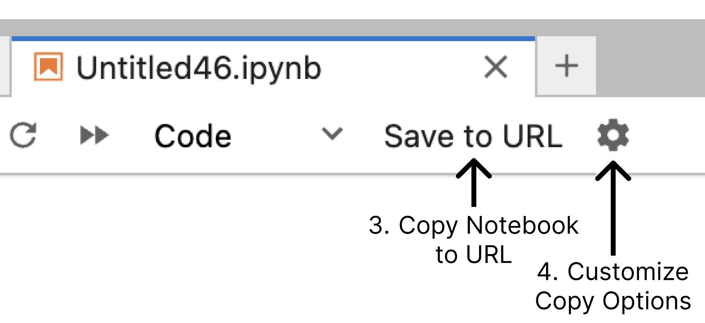

# nblink 🔗

[](https://www.dylanwootton.com/jupyterlite/lab/index.html?tempNotebook=1&path=temp.ipynb&openAsNotebook=1#notebook=N4IgtgpgLghgJjWIBcoDWEBOA7CAbAZwAcIBjFUbGSFEIgTygAsB7bEAGhDgEti8Y9APpUayEAAVGrbAAIAFFJa84EAJScQA7AHMArjB0RaDZmxABfLtv2GIQntgBmLCiFLKIYHpkwtMQmCebqLG4qYymgBuWAQ85sgAzFYgTjx49hAAHlAQ2HEJIAB0DJrekFD0JLS5OQD0WQC0EeZcoSbSrSDYAEYe2DGYUELZRP65mB1m7FwMOpDYUARCGVlYtDwt2InRsfHs4olFAByWKb0umGCIgY7+KAAsbT2X11CPXKT4hCgA2qBfPB4ISVariDyqTQEFh6TBfWgAUiIm1kjgIsCBshg2HoAHceHAjFAADrYJEotEYvBYvCwHyk8lEVH5KmyGI6GBCBCwAjQAgM5FMykwTFEbEIAhlaDwRAwNxQTB6dEQOAoBV6CApGFQIh6JZ-AC6XGyZD1+yEHj0ixQ2D0QKsAO+IKqYXcwS40Nh8PEAGJZAAlCDwWTMCCyADCAGUAGqybkwUk8MBjIayMXYCVYghpuCJ5PjGl0zBZwuk0k+vIwHoZWSYIO8XSybITKjU0gEKJ5lNQNP0ZQE+xMKA60kMfuqIRDnUlRCkJhCEV4eRqMsZ2WyAC8OaKdfgFo78mJICnRAIyDqdR0fCgRSvzD0PSVWH6uUWRQ8YDqcFxLBYw7YdSJAA7AATKQACsThwH04EPA8PQPAADEBACMpDHIkPQAGwPDADwQA8xwwKQQGkHUmAwLidQ9CBDxwIhDxoUBxwAJw4XBiROKQpBwA8UGIX0QFOFhQGIaQLE9MhQGJFhcCXngLA9CKuTJgQ74dkeK7YH64a7rkIZMGGACCtIwD4shzjAQykryGSkFA+yboWRS2WQDlsEIYyOFA8i4FZEDohuAAqioQBwshsBuR5eYsWAsIMR7haEG4AORihRYBCEBKVaZZqZbspRThkwVk+fGahFNcmBoEIdb2cuRR5BCECHnIsjtVkG6FQAGvIKX0EGmDIAA8il4UwFkfAbgAcmw6gcKS7XtR4CmYF1tJFSwq19SpRDIAAimNi1LSdp1nbIBCkCKEDrTekZXRkrXnc9L1wCw1yOAAsgSG6IQtbUvYDS0UboN2-MdQOQ0tR4+iJiHwwAIolsgw0Z4GIQAYih4HIzD4YAEIoccKFI5wKMgD6ACiGOJPjIHhrjFMY-jWFGQ8RmJRDUOQzDGPhixIGgYzPp8-j+NGShwsY5TlOIQjIFSxjStK8LCMy-jGNAZzAPc0DeNYQj+PU8LLGU+GRmU5LZMw1h4uUwjWHCw8IEC+GjvWxTIEoah+M45wXO6y9MOIcc4EoSxDMez6IeJIhttHgHgdLUaidJ7WECDLywWhanUNqP9aftRkRgZjNc351z9C3UUACafVwHoYBgPQyDTWNWKTQQZe4FpFUKtiBCvBaIqkHaiAtVzDdN1XR5W6SFVEH4JBDDwAVPUt+JwMwG7AClypEClyCyOBVhc4ZPA6EOG4gfD8-vmwaT6HWQhRKvuLr+16J+BgADqBLb4hO+8A4CeSstQAg8hXL2X2LlEqQwpSwHjPKRUypVTIHVJqLg2pdT6mQL8I0IATSj3ctgC0MJrTIFtPaDgjogTOjBG6SEHoYRwldAgmUSBUAgHVKgtUoUtR6hwZKPBBCiFmg8paChVC8AWANBYIAA)


## A JupyterLab Extension for Sharing Notebooks via URL

nblink is a JupyterLab extension that allows you to easily share your Jupyter notebooks by encoding their content into a URL. This enables quick sharing and collaboration without the need for file transfers or cloud storage.

## Features

- **Save to URL**: Compress and encode your notebook content into a shareable URL with a single click.
- **Configurable Settings**: Choose whether to include cell outputs and select the appropriate URL path for your Jupyter environment.
- **Easy Sharing**: The generated URL is automatically copied to your clipboard for immediate sharing.

## Installation

To install the extension, run the following command in your environment:

```{python}
pip install nblink
```

### Installation on Jupyterlite

If you are [deploying your own jupyterlite instance](https://jupyterlite.readthedocs.io/en/latest/quickstart/deploy.html), you can install nblink by adding it to your requirements.txt. See [adding additional requirements](https://jupyterlite.readthedocs.io/en/latest/quickstart/deploy.html#add-additional-requirements-to-the-deployment) to the deployment.

1. Follow the instructions here to deploy your own jupyterlite instance: [Deploying JupyterLite](https://jupyterlite.readthedocs.io/en/latest/quickstart/deploy.html).
2. Add `nblink` to your requirements.txt file.
3. Push your changes to github, triggering a new deployment containing the nblink extension.
4. Confirm the extension is installed by opening a notebook and looking for the "Save to URL" button in the notebook toolbar.

## Usage



1. Open a Jupyter notebook in JupyterLab.
2. Look for the "Save to URL" button in the notebook toolbar. *note: in notebook views, the Save to URL button appears on the right hand side of the toolbar.*
3. Click the main button to save the current content of your notebook to a URL.
4. Use the settings icon (gear) next to the main button to configure options:
   - Toggle including cell outputs
   - Select the appropriate URL path for your Jupyter environment or enter a custom path
5. Share the generated URL.

## Architecture

nblink is composed of two main components: compression and decompression.

### Compression

The compression mechanism, implemented in the `urlUtils.ts` file, is responsible for taking the current state of a Jupyter notebook and encoding it into a compact URL format. This process involves serializing the notebook's content, including cells, outputs (if specified), and metadata, then compressing this data using the LZ-string algorithm. The resulting compressed string is then embedded into a URL, along with additional parameters such as the desired view mode (lab or notebook) and other settings. This compressed URL serves as a portable representation of the notebook, allowing users to easily share their work.

### Decompression

On the receiving end, the decompression routes, primarily handled in the `notebookRoute.ts` file, manage the process of reconstructing a notebook from a compressed URL. When a user navigates to a URL containing compressed notebook data, the extension intercepts this request, extracts the compressed content, and decompresses it back into a full notebook structure. It then creates a new temporary notebook in the Jupyter environment, populates it with the decompressed content, and opens it for the user. This process effectively allows notebooks to be shared and opened without needing to save or transfer actual notebook files.

## Configuration

The extension provides two main configuration options:

1. **Copy Notebook Output**: When enabled, cell outputs are included in the generated URL. This is disabled by default to keep URLs shorter but will require the recipient to run the notebook to see the outputs. Modern notebook
2. **URL Path**: Choose the appropriate path based on your Jupyter environment:
   - `/lab/index.html` for JupyterLab
   - `/retro/notebooks/index.html` for Jupyter Notebook

## Inspiration

This project draws inspiration from the Vega Editor's "Save to URL" feature and PyCafe's goal to simplify sharing python data apps. We've adapted these ideas to the Jupyter ecosystem, aiming to make notebook sharing as easy as passing along a URL. While our approach differs, we're all working towards making collaboration in the coding world more accessible. We encourage you to check out these awesome projects too: Vega Editor (https://vega.github.io/editor/) and PyCafe (https://py.cafe/).

## Contributing

We don't have a formal contributing process right now, but we're open to feedback and suggestions. Feel free to open an issue or reach out to us directly if you have any ideas or improvements in mind.

## License

This project is licensed under the BSD-3-Clause License. See the [LICENSE](LICENSE) file for details.
